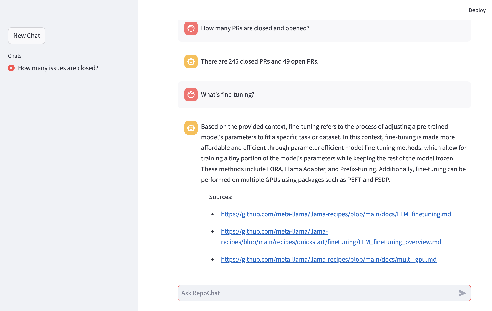
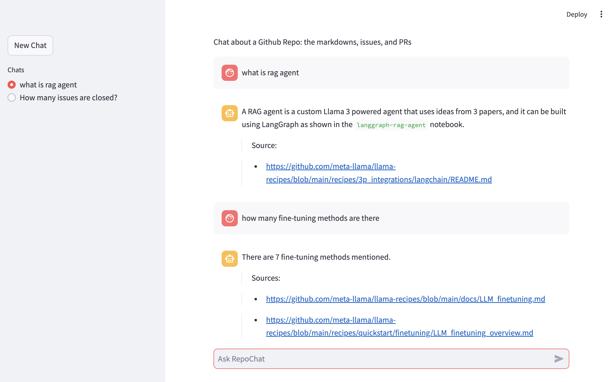
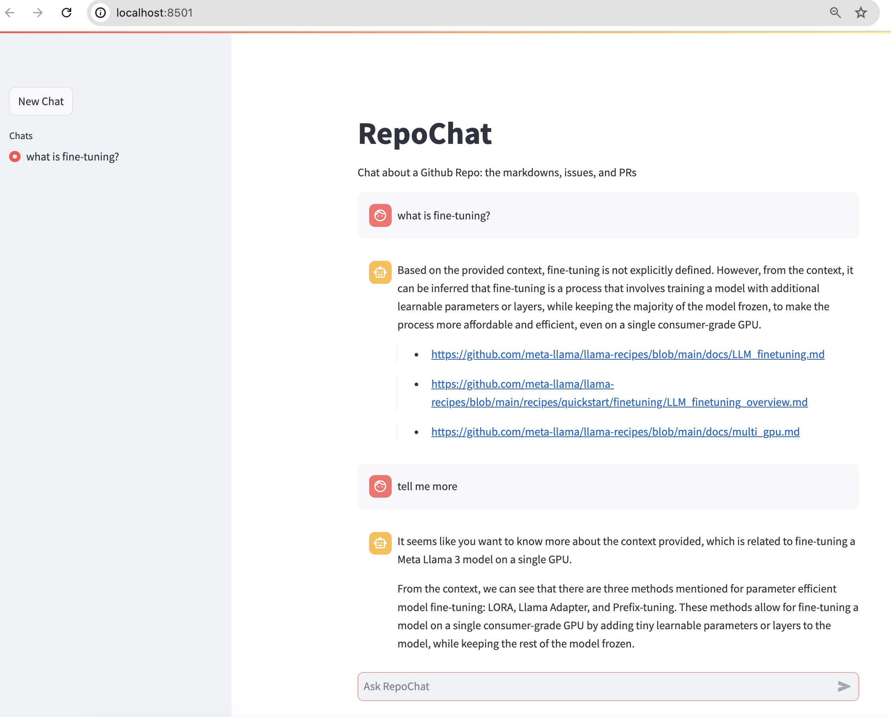

# RepoChat
This repo shows how to use ReAct agent, RAG, Llama 3 and LangChain to build chatbots with a streamlit web UI to chat about a github repo - its issues, PRs, and content.

## Setting up the environment

First, set up a conda or virtual environment and install the required packages:
```
pip install -r requirements.txt
```

Then add two environment variables:
* Get a free `LANGCHAIN_API_KEY` from [LangChain](https://smith.langchain.com/), and:
```bash
export LANGCHAIN_API_KEY=<your_langchain_api_key>
```
* Get a free trial GROQ_API_KEY at [Groq.com](https://groq.com/), then:
```bash
export GROQ_API_KEY=<your_groq_api_key>
```

* Set your `GITHUB_PERSONAL_ACCESS_TOKEN` (get your token [here](https://github.com/settings/tokens)):
```bash
export GITHUB_PERSONAL_ACCESS_TOKEN=<your_github_access_token>
```

## Loading and indexing the repo

First, set `GITHUB_REPO_PATH` and `VECTOR_DB_PATH` in `config.py` such as:
```
GITHUB_REPO_PATH = "meta-llama/llama-recipes"
VECTOR_DB_PATH = 'vectorstore/llama-recipes'
```

Then, build the index by running `python github_loader.py`, with the default device type as `cpu` - this may take 10+ minutes to run; if you have a GPU, `python github_loader.py --device cuda`.

## Running the ReAct-powered RAG Chatbot

Run:
```
streamlit run rag_agent.py
```

Then open `http://localhost:8501` on your browser.

Questions you may ask include:

* How many issues are closed?
* How many issues are opened?
* How many PRs are closed and opened?
* What's fine-tuning?




You can start a new chat as shown above.

## Running the Multi-turn RAG Chatbot

Run:
```
streamlit run main.py
```
Then open `http://localhost:8501` on your browser.

Questions you may ask include:

* What's fine-tuning?
* Tell me more.


